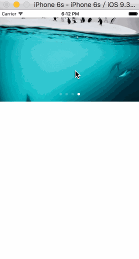
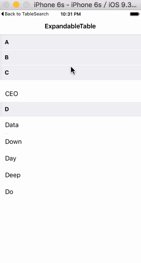
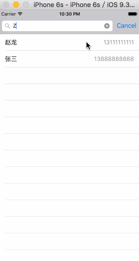

# CXYSwiftStudy

###知识参考：  
0.[https://github.com/ipader/SwiftGuide](https://github.com/ipader/SwiftGuide)  
1.[http://opensource.apple.com/source/](http://opensource.apple.com/source/)  
2.[http://wiki.jikexueyuan.com/project/swift/](http://wiki.jikexueyuan.com/project/swift/)  
3.[http://swifter.tips](http://swifter.tips)  
4.[http://swift.gg](http://swift.gg)  
5....(一些blog)

---

  

###一. Playground  

##### 1.Tutorial.playground  

  

  
###二. Demo  

#####1.图片轮播  
  
  
#####2.可展开的TableView  
   
  
#####3.搜索Table  
  
  
#####4.视图弹出Presentation  
  

 
